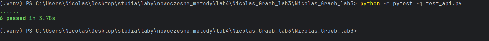
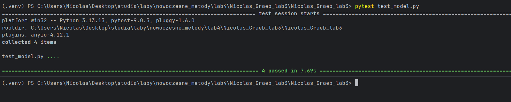
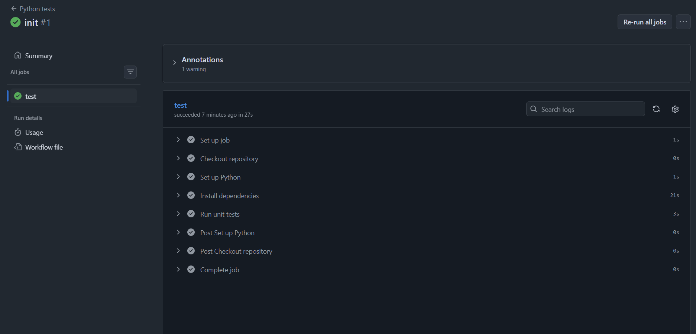
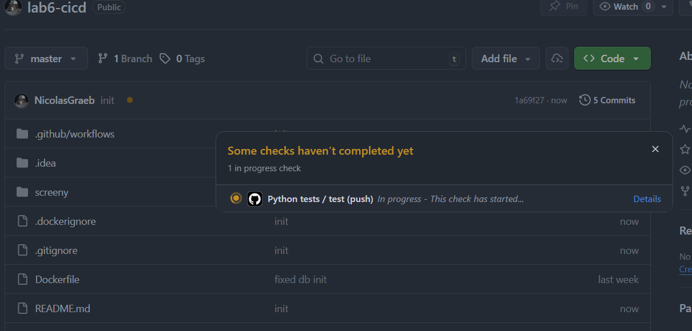
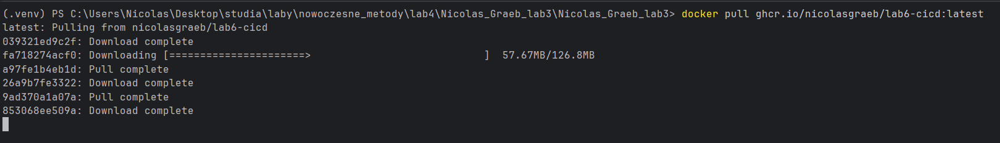

# lab6
Autor - Nicolas Graeb

W tym repozytorium realizuję zadania z zakresu CI/CD dla aplikacji API z modelem ML (Iris + FastAPI + Docker + GitHub Actions).

## Opis projektu

Stworzyłem aplikację API w `main.py`, która:
- ładuje zbiór Iris,
- trenuje model `LogisticRegression`,
- udostępnia endpointy:
  - `GET /`
  - `GET /health`
  - `GET /info`
  - `POST /predict`
  - `GET /predictions`

Warstwa bazy danych znajduje się w `db.py`, a inicjalizacja w `init_db.py`.

---

## Zadanie 1: Przygotowanie repozytorium z przykładowym modelem ML

### 1) Repozytorium GitHub

Utworzyłem repozytorium i umieściłem w nim aplikację API z poprzednich zajęć.

Najważniejsze pliki:
- `main.py` - logika API i model ML,
- `db.py` - zapis i odczyt predykcji,
- `requirements.txt` - zależności projektu,
- `Dockerfile` - budowanie obrazu aplikacji.

### 2) Testy jednostkowe

Napisałem testy jednostkowe w bibliotece `pytest`:
- `test_model.py` - testy predykcji modelu (zakres klas, długość, accuracy),
- `test_api.py` - testy endpointów API (`/`, `/health`, `/info`, `/predict`, `/predictions`).

Uruchamianie testów lokalnie:

```bash
python -m pytest -q
```

Materiały potwierdzające:



---

## Zadanie 2: Konfiguracja GitHub Actions do automatycznego testowania

### 1) Workflow testów

Skonfigurowałem workflow w pliku:
- `.github/workflows/workflow.yml`

Workflow:
- uruchamia się automatycznie na:
  - `push` do gałęzi `main`,
  - `pull_request` do gałęzi `main`,
- instaluje zależności z `requirements.txt`,
- uruchamia testy komendą:

```bash
pytest -q
```

### 2) Weryfikacja działania

Działanie workflow weryfikuję w zakładce **Actions** na GitHubie.

Materiały potwierdzające:



---

## Zadanie 3: Automatyczne budowanie obrazu Dockera i publikacja

### 1) Dockerfile

Dodałem i wykorzystałem `Dockerfile`, który:
- bazuje na `python:3.12-slim-bookworm`,
- kopiuje `requirements.txt` i instaluje zależności,
- kopiuje pliki aplikacji (`*.py`, `start.sh`),
- uruchamia API przez `start.sh`.

Lokalne budowanie obrazu:

```bash
docker build -t iris-api-local:test .
```

### 2) Workflow budowania i publikacji obrazu

Skonfigurowałem osobny workflow:
- `.github/workflows/docker-publish.yml`

Workflow:
- uruchamia się na każdym `push` do `main`,
- buduje obraz Dockera,
- publikuje obraz do GitHub Container Registry (`ghcr.io`).

Publikowane tagi:
- `latest`
- `sha` commita.

### 3) Weryfikacja publikacji obrazu

Publikację obrazu weryfikuję:
- w zakładce **Actions** (status workflow),
- w sekcji **Packages** na GitHubie,
- przez pobranie obrazu komendą `docker pull`.

Materiał potwierdzający:


---

## Podsumowanie

W ramach laboratorium:
- przygotowałem repozytorium z API i modelem ML,
- dodałem testy jednostkowe w `pytest`,
- skonfigurowałem CI dla testów (`workflow.yml`),
- skonfigurowałem CD dla obrazu Dockera (`docker-publish.yml`),
- zweryfikowałem działanie testów i budowanie/publikację obrazu.
