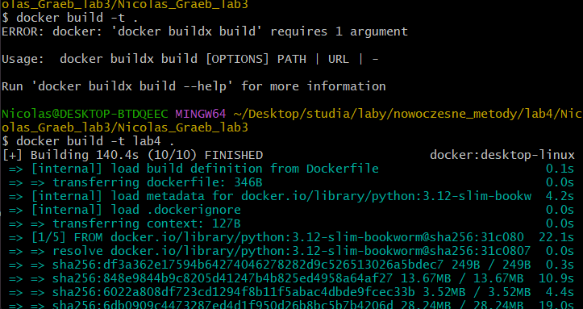
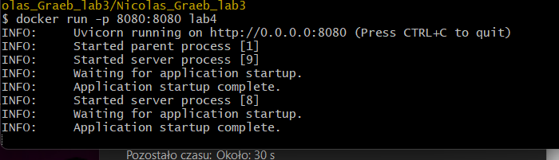
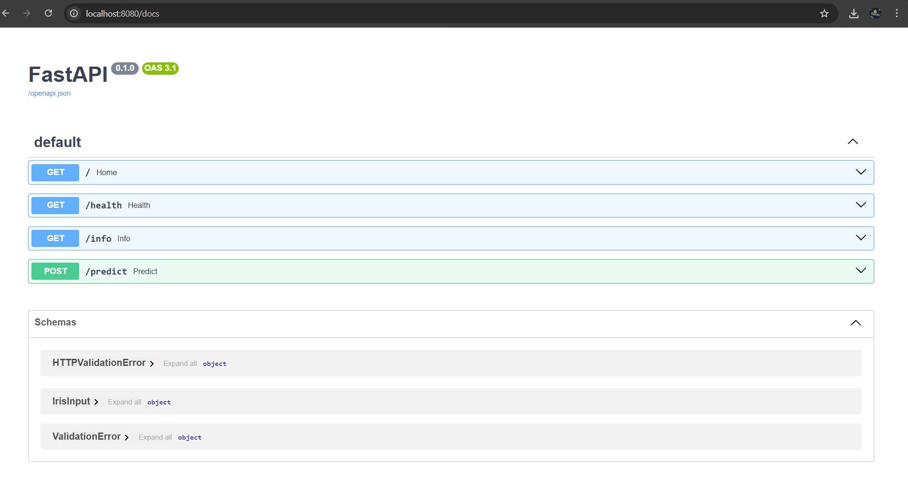
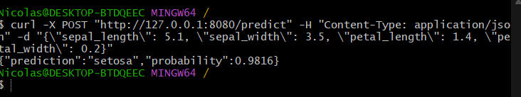
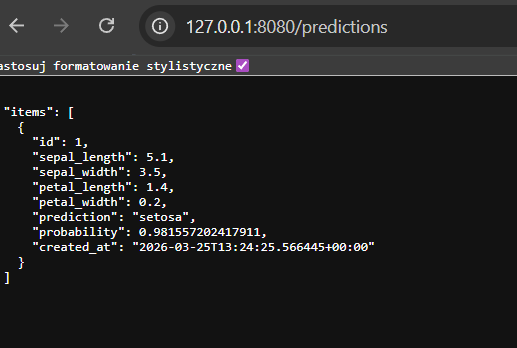

## Lab 3: API ML w Dockerze (FastAPI + scikit-learn)

Poniżej opisuję wymagania dla **Zadania 1** i **Zadania 2** na podstawie moich plików: `main.py` oraz konfiguracji kontenera w `Dockerfile` (u mnie podpisane jako `dcokerfail`).

---

## Zadanie 1: Przygotowanie aplikacji API

Moim zadaniem było przygotowanie aplikacji API na bazie kodu z poprzednich zajęć oraz przygotowanie pliku `requirements.txt` z bibliotekami potrzebnymi do działania serwera i modelu ML.

### Co jest w aplikacji

Aplikację FastAPI umieściłem w pliku `main.py`. Udostępniam endpointy:

- `GET /` – prosty komunikat powitalny
- `GET /health` – test dostępności
- `GET /info` – informacje o modelu i danych (np. typ modelu, liczba cech/klas)
- `POST /predict` – predykcja dla danych wejściowych (cechy kwiatu Iris) + zapis rekordu do bazy (jeśli skonfigurowane `DATABASE_URL`)
- `GET /predictions` – pobranie zapisanych predykcji z tabeli `predictions`

Model ML trenuję w kodzie na danych `sklearn.datasets.load_iris()` (model `LogisticRegression`).

### Plik `requirements.txt`

W pliku `requirements.txt` przygotowałem zależności wymagane przez aplikację, m.in.:

- `fastapi` (API)
- `uvicorn` (uruchomienie serwera)
- `scikit-learn` (model + dane Iris)
- dodatkowe zależności przekładane przez FastAPI/Pydantic i ekosystem scikit-learn

Plik umieściłem w głównym katalogu projektu jako `requirements.txt`.

### Uruchomienie bez Dockera (lokalnie)

1. Zainstalowałem zależności:

```powershell
pip install -r requirements.txt
```

2. Uruchomiłem serwer:

```powershell
uvicorn main:app --host 0.0.0.0 --port 8080
```

---

## Zadanie 2: Dockerfile i budowa obrazu

Moim zadaniem było przygotowanie `Dockerfile`, skopiowanie aplikacji i `requirements.txt` do kontenera, zainstalowanie zależności oraz uruchomienie serwera.

### `Dockerfile` (u mnie: `dcokerfail`)

W projekcie mam plik `Dockerfile`. Jest skonfigurowany tak, aby:

- bazować na oficjalnym obrazie Pythona: `python:3.12-slim-bookworm`
- ustawić `WORKDIR /app`
- skopiować `requirements.txt` do kontenera i wykonać `pip install --no-cache-dir -r requirements.txt`
- skopiować `main.py` do kontenera
- wystawić port `8080`
- uruchomić aplikację przez `uvicorn main:app --host 0.0.0.0 --port 8080 --workers 2`

W praktyce serwer uruchamia się od razu po zbudowaniu i uruchomieniu kontenera.

### Budowa obrazu lokalnie

W katalogu projektu wykonuję:

```powershell
docker build -t ml-api .
```

### Uruchomienie kontenera

```powershell
docker run --rm -p 8080:8080 ml-api
```

### Test działania API (przykłady)

1. Health check:

```powershell
curl http://localhost:8080/health
```

2. Informacje o modelu:

```powershell
curl http://localhost:8080/info
```

3. Predykcja:

```powershell
curl -X POST http://localhost:8080/predict -H "Content-Type: application/json" -d '{"sepal_length":5.1,"sepal_width":3.5,"petal_length":1.4,"petal_width":0.2}'
```

---

## Screeny (budowanie i testy)

### Budowanie obrazu



### Uruchomienie obrazu



### Test API



### Test API (curl)



---

## Zadanie 3: Uruchamianie kontenera i testowanie endpointu

1. Zbudowałem obraz aplikacji poleceniem:
```powershell
docker build -t ml-api .
```

2. Uruchomiłem kontener z mapowaniem portu tak, aby serwer FastAPI działał na `8080` na hoście:
```powershell
docker run --rm -p 8080:8080 ml-api
```

3. Przetestowałem endpoint `POST /predict` za pomocą `curl` (maksymalna ocena 5):
```powershell
curl -X POST http://localhost:8080/predict `
  -H "Content-Type: application/json" `
  -d '{"sepal_length":5.1,"sepal_width":3.5,"petal_length":1.4,"petal_width":0.2}'
```

---

## Zadanie 4: Konfiguracja Docker Compose

1. Utworzyłem plik `docker-compose.yml`, w którym uruchomiłem serwis `ml-app` (zbudowany z mojego `Dockerfile`) w osobnej sieci dockera (`lab-network`) oraz mapowałem port aplikacji `8080`.

2. Dodałem drugi serwis `postgres` i skonfigurowałem dane logowania/DB (`POSTGRES_USER`, `POSTGRES_PASSWORD`, `POSTGRES_DB`). W `ml-app` ustawiłem zmienną środowiskową `DATABASE_URL`, aby aplikacja mogła zapisywać wyniki predykcji do tabeli `predictions` (po każdym wywołaniu `POST /predict` rekord trafia do bazy, a `GET /predictions` zwraca zapisane rekordy).

3. Po uruchomieniu Compose przetestowałem aplikację ponownie:
```powershell
docker compose up -d --build
```

Test zapisu:
```powershell
curl -X POST http://localhost:8080/predict `
  -H "Content-Type: application/json" `
  -d '{"sepal_length":5.1,"sepal_width":3.5,"petal_length":1.4,"petal_width":0.2}'
```

Odczyt zapisanych rekordów:
```powershell
curl http://localhost:8080/predictions
```



## Zadanie 5: Uruchomienie aplikacji w trybie produkcyjnym

1. Dodałem do repozytorium krótkie instrukcje uruchamiania aplikacji w pliku `guide.md` w trzech wariantach: lokalnie, przez Docker oraz przez Docker Compose.

2. Opisałem, jak skonfigurować parametry (zmienne środowiskowe) i jakich zasobów potrzebuje aplikacja:
- aplikacja potrzebuje `DATABASE_URL` (jeśli ma zapisywać i odczytywać predykcje z PostgreSQL),
- w Docker Compose wymagane są zmienne dla bazy `POSTGRES_USER`, `POSTGRES_PASSWORD`, `POSTGRES_DB`.

3. Utworzyłem repozytorium na GitHubie: https://github.com/NicolasGraeb/laboratorium_ntpd