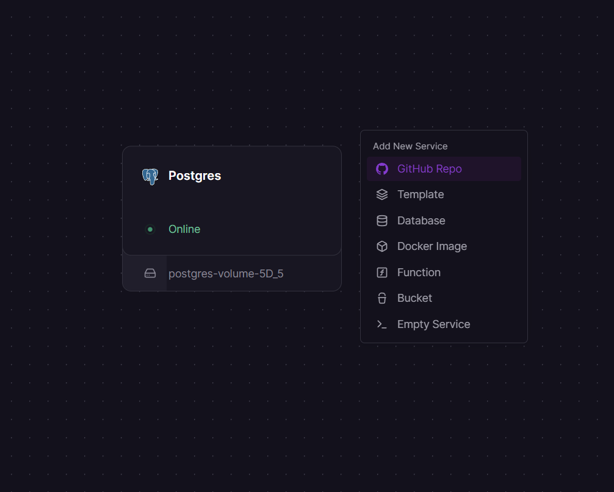
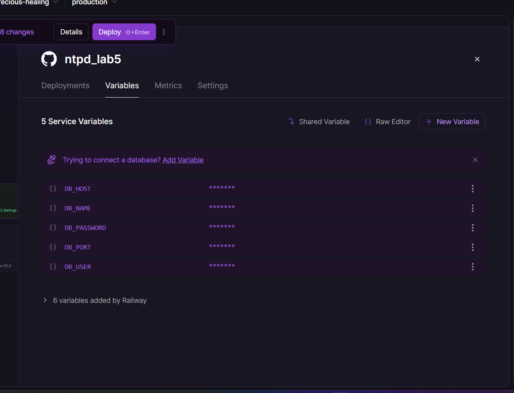
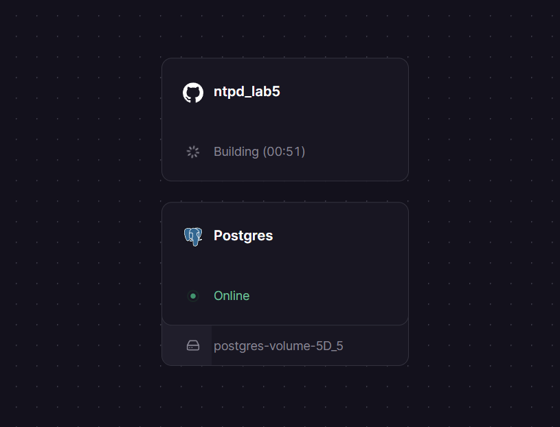
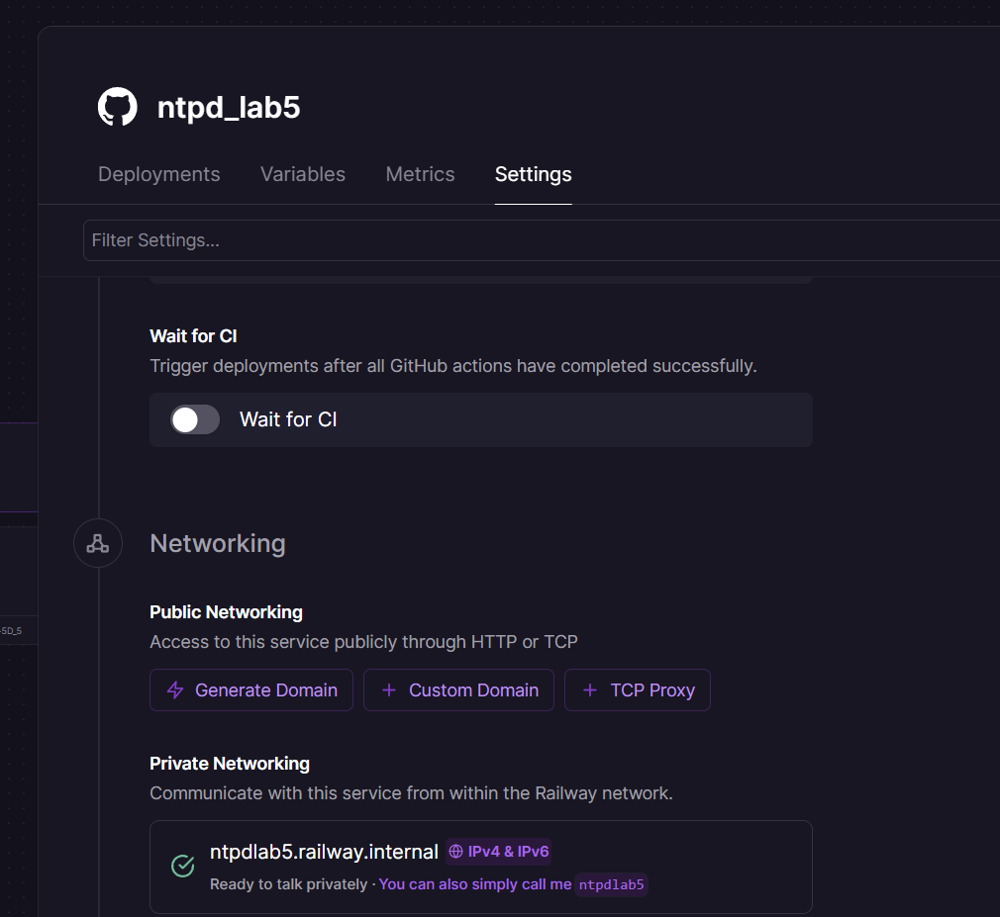
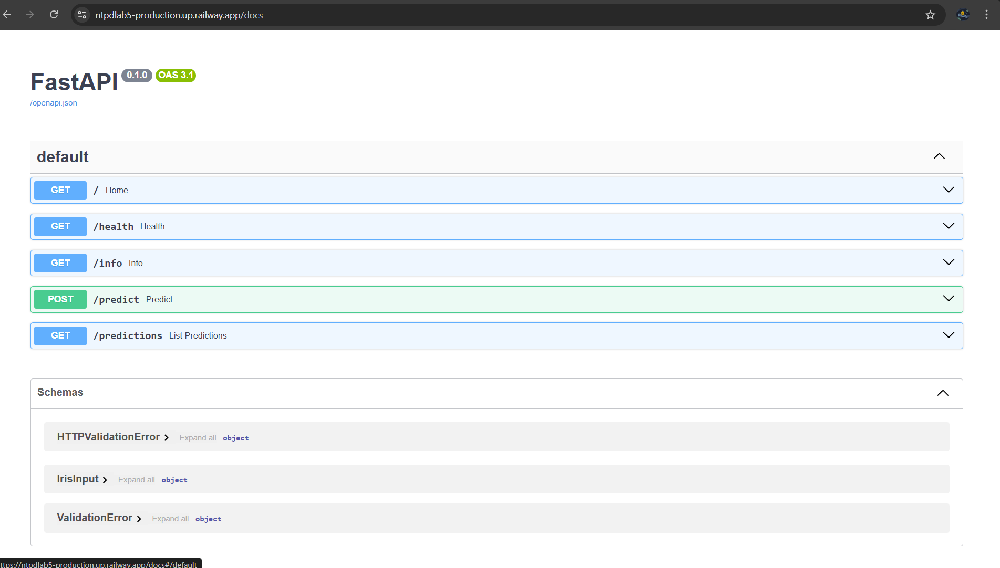
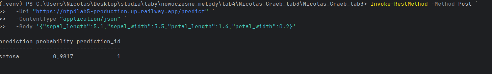
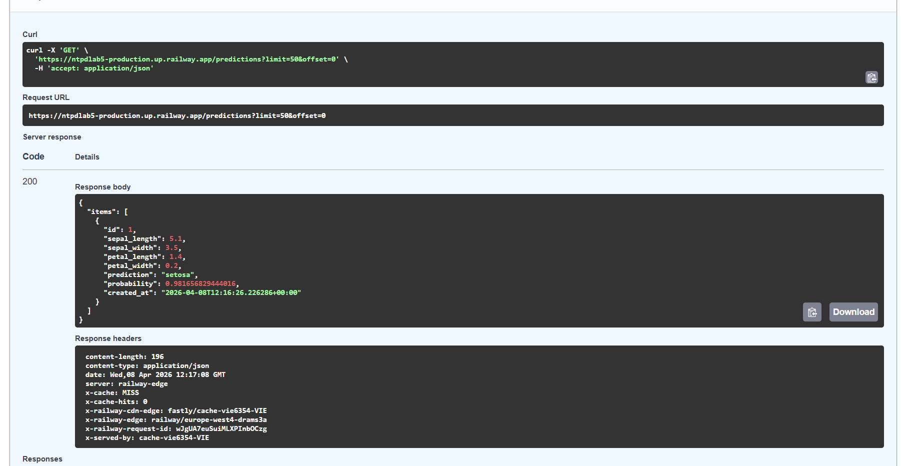

## Zadanie 1

W zadaniu korzystam z aplikacji API z poprzednich zajęć (FastAPI + model Iris).

## Mój `.dockerignore` (w skrócie)

Plik pomija zbędne elementy, aby obraz budował się szybciej i był mniejszy:
- środowisko lokalne i cache: `venv`, `__pycache__`, `*.pyc`, `.pytest_cache`, `.mypy_cache`
- pliki repozytorium: `.git`, `.gitignore`
- materiały pomocnicze: `screeny/`, `*.png`, `*.md`

## Mój `Dockerfile` (w skrócie)

`Dockerfile`:
- bazuje na `python:3.12-slim-bookworm`
- ustawia `WORKDIR /app`
- kopiuje `requirements.txt` i instaluje zależności
- kopiuje pliki `.py` oraz skrypt startowy `start.sh`
- nadaje uprawnienie wykonywania dla `start.sh`
- wystawia port `8080`
- uruchamia kontener komendą `./start.sh` (najpierw inicjalizacja bazy, potem start API)

## Opis screenów

### Dodawanie bazy danych

Dodaję bazę PostgreSQL do mojego projektu na Railway. W tym kroku tworzę usługę bazy danych, która będzie przechowywać wyniki predykcji.

### Dodawanie backendu

Wybieram moje repozytorium, z którego Railway buduje backend. Dzięki temu platforma pobiera kod i przygotowuje automatyczny deployment aplikacji.

### Zmienne środowiskowe

Dodaję wymagane zmienne środowiskowe, aby połączyć backend z wcześniej utworzoną bazą danych. Ustawiam dane połączenia do PostgreSQL, dzięki czemu aplikacja może zapisywać i odczytywać predykcje.

### Budowanie backendu

Tutaj trwa budowanie backendu. Railway tworzy obraz aplikacji na podstawie mojego `Dockerfile` i instaluje wszystkie zależności potrzebne do uruchomienia API.

### Generowanie domeny

Generuję domenę dla mojej aplikacji. Po tym kroku backend otrzymuje publiczny adres URL, pod którym mogę testować endpointy.

### Backend działa

Wchodzę na dokumentację FastAPI i widzę dostępne endpointy. To potwierdza, że backend uruchomił się poprawnie i API działa.

### Test API

Sprawdzam, czy mój endpoint działa poprawnie. Wysyłam dane testowe i w odpowiedzi otrzymuję predykcję modelu.

### Endpoint GET

To endpoint, który zwraca zapisane predykcje z bazy danych PostgreSQL. Widzę tutaj rekordy dodane po wywołaniach `POST /predict`.

url do aplikacji: https://ntpdlab5-production.up.railway.app/

## Zadanie 4: Porównanie zalet i wad wdrożeń serverless vs własny serwer

### Wdrożenie serverless (np. Railway)

**Zalety:**
- szybki start i prosty deployment bez ręcznej konfiguracji serwera,
- automatyczne skalowanie przy większym ruchu,
- mniejsze koszty na początku projektu (płacę głównie za użycie),
- mniej pracy utrzymaniowej (aktualizacje platformy, monitoring podstawowy, logi).

**Wady:**
- mniejsza kontrola nad środowiskiem i konfiguracją systemową,
- możliwe opóźnienie przy „zimnym starcie” aplikacji,
- ryzyko uzależnienia od konkretnej platformy (vendor lock-in),
- przy stałym, dużym ruchu koszt może być wyższy niż własny serwer.

### Wdrożenie na własnym serwerze

**Zalety:**
- pełna kontrola nad systemem, konfiguracją i sposobem uruchamiania usług,
- łatwiejsze dopasowanie środowiska do niestandardowych wymagań,
- przy dużym i przewidywalnym ruchu często korzystniejszy kosztowo model.

**Wady:**
- więcej pracy administracyjnej (konfiguracja, aktualizacje, bezpieczeństwo, kopie zapasowe),
- wolniejszy start projektu i większa złożoność wdrożenia,
- konieczność samodzielnego zapewnienia monitoringu, skalowania i wysokiej dostępności.

### Krótki wniosek

W moim przypadku lepszym wyborem jest podejście serverless, bo pozwala mi szybko wdrożyć aplikację i skupić się na logice backendu. Własny serwer ma sens głównie wtedy, gdy potrzebuję pełnej kontroli nad infrastrukturą albo mam stabilny, duży ruch i chcę optymalizować koszty długoterminowo.
